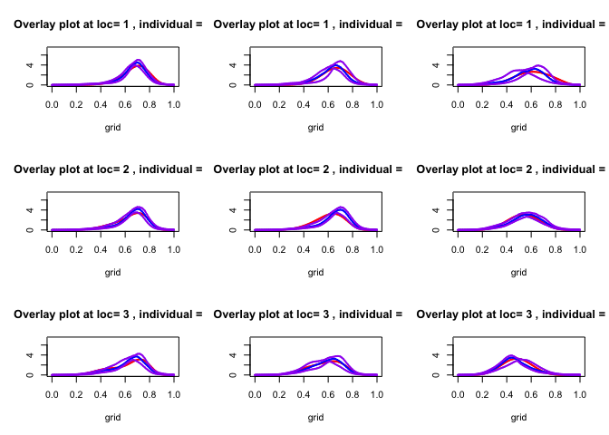
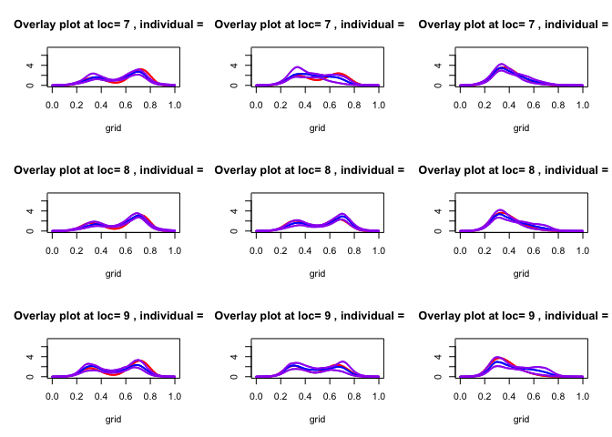
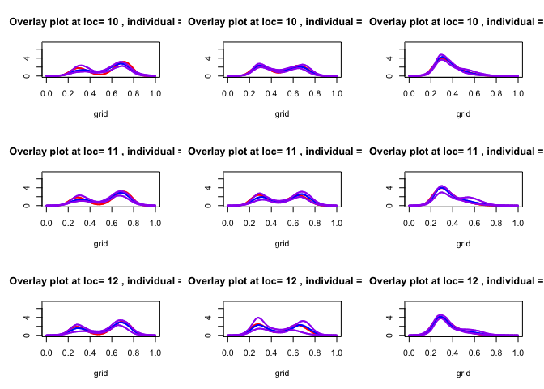
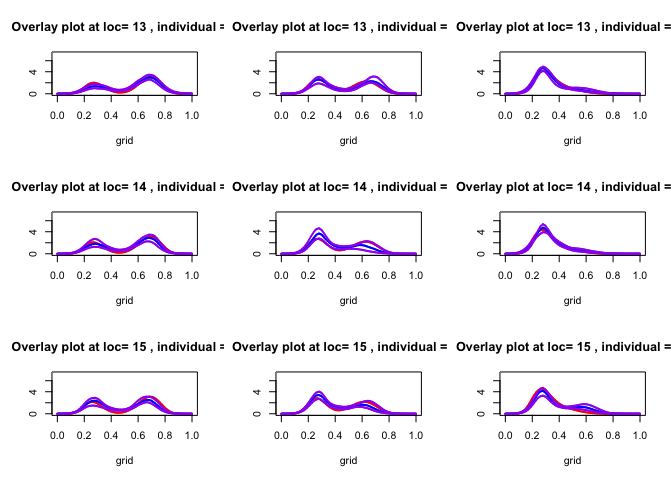
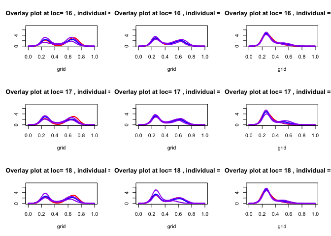
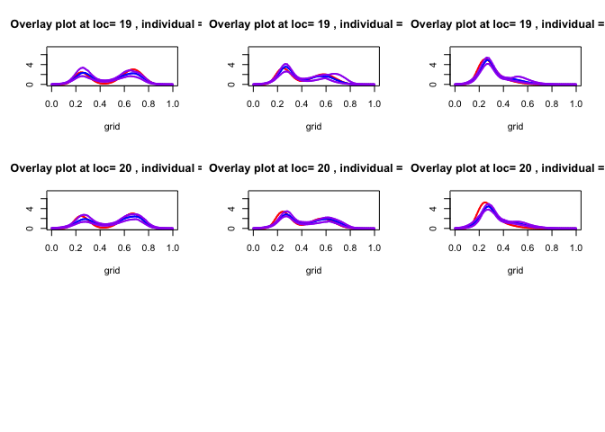
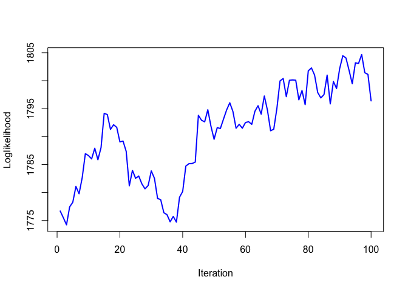

logisticGP package vignette
================

## Install R Package

``` r
#devtools::install_github("Zmup2eSNntdt/logisticGP")
```

## Load Library

``` r
library(ddalpha)
```

    ## Loading required package: MASS

    ## Loading required package: class

    ## Loading required package: robustbase

    ## Warning: package 'robustbase' was built under R version 4.3.1

    ## Loading required package: sfsmisc

    ## Loading required package: geometry

``` r
library(xgboost)
```

    ## Warning: package 'xgboost' was built under R version 4.3.1

``` r
library(logisticGP)
```

## Data Generation

``` r
n1=200
p1=5
K1=20
n2 = 0.2 * n1 ## test set
RNGkind(sample.kind = "Rejection")
set.seed(403)
index.sample = sample(1:n1,size=n2,replace = F)
theta_func<- function(j,x){
  if(j==1)
    return(x^2+1)
  if(j==2)
    return((1-x)^2)
  if(j==3)
    return(4*x*(1-x))
  if(j==4)
    return(-1 + 2*(x-0.75)^2)
  if(j==5)
    return(1.5 + 4*sin(x-0.5))
  if(j==6)
    return(cos(x+2) + 0.25 * (x-0.5)^4 )
  if(j==7)
    return(log(x+1)- 4*x^2)
  else
    return("wrong input")
}
theta.true<-matrix(0,nr=p1,nc=K1)
for(j in 1:p1){
  theta.true[j,]<- (matrix(theta_func(j, seq(0,1,length.out = K1)),nr=1))
}

set.seed(842)
X1<- matrix(runif(n1*p1,-5,5),nc=p1)
X1<- apply(X1,MARGIN = 2,FUN = function(x)(x-mean(x)))
max_norm<- max(sqrt(rowSums(X1*X1)))
X2<- X1/max_norm

beta<-theta.true
theta.true<- t(t(beta)/sqrt(colSums(beta * beta)))
W_0 <-(kronecker(diag(ncol(beta)),X2) %*% matrix(as.vector(theta.true),nc=1) + 1)/2
W_1 <- 2*(W_0-0.5) #Centralize the probability
y_vec<-numeric(nrow(X2) * ncol(theta.true))
y1<- matrix(0,nr=n1,nc=K1)
for (j in 1:K1) {
  for(i in 1:n1){
    y_vec[(j-1)*nrow(X2) + i]<-ifelse(runif(1)<=1/(1+exp(W_1[(j-1)*nrow(X2) + i])),
                                      rbeta(1,10*exp((j/ncol(theta.true)-0.5)/2),4*j^{3/4}),
                                      rbeta(1,32*sin(W_0[(j-1)*nrow(X2) + i]), 8*(j/ncol(theta.true) +1)^{1/2}))
  }
}
y1<- matrix(y_vec,ncol = ncol(theta.true))
test_knots = seq(0,1, length.out = 51)
Nplus = length(test_knots)
X = X_train <- X2[-index.sample,]
X_test <- X2[index.sample,]
y = y_train <- y1[-index.sample,]
y_test <- y1[index.sample,]

beta_Sigma<- 1*Sigma_kron(tau=0.05,rho=0.75, K=ncol(y), p=ncol(X))

Gamma1 = Matern_cov(test_knots, nu= 2.5, sigma = 1,theta = 0.292)

CHOL1 = t(chol(Gamma1))

xi = matrix(CHOL1%*%rnorm(Nplus^2),nc=Nplus,byrow = T)
beta<- matrix(as.vector(mvtnorm::rmvnorm(1,mean = rep(0, ncol(X)*ncol(y)))),nc=ncol(y))
beta<- t(t(beta)/sqrt(colSums(beta * beta)))
tau = matrix(CHOL1%*%rnorm(Nplus^2),nc=Nplus,byrow = T)
h_loc = hBasis(seq(0,(K1-1),by=1)/(K1-1),test_knots)
```

## Model Fitting

``` r
nmcmc=500
burnin=500
thining=5
run1<- get_updates(xi=xi,
                   beta = beta, 
                   tau=tau,
                   CHOL1 = CHOL1,
                   h_loc=h_loc, 
                   X=X,
                   y=y,
                   test_knots = test_knots,
                   verbose = T, burnin = burnin,nmcmc = nmcmc,thining = thining)
```

    ## [1] 100
    ## [1] 200
    ## [1] 300
    ## [1] 400
    ## [1] 500
    ## [1] 600
    ## [1] 700
    ## [1] 800
    ## [1] 900
    ## [1] 1000
    ##    user  system elapsed 
    ##  75.140   5.678  81.106

``` r
XI_mat = run1$XI_mat.out
TAU_mat = run1$TAU_mat.out
BETA_mat = run1$BETA_mat.out

n <- nrow(X) #no. of individuals
K <- ncol(y) #no. of Location
p <- ncol(X) #no. of covariates
#######################
#######################
grid<- seq(0,1,length.out = 10001)
par(mfrow=c(3,3))
#location.1<-c(1,10,20)
location.1<-sort(sample(1:K,K,replace = F))
density_mat<- matrix(0,nr=length(grid),nc=length(location.1))
density_mat.true<- density_mat
density_mat.NNKCDE<- density_mat
ind.index = c(9,11,12)
X_new=matrix(X_test[ind.index,],nc=p)
for(i in 1:length(location.1))
{
  theta.true.1<- theta.true[,location.1[i]]
  a.vec<- as.numeric((X_new%*%theta.true.1+1)/2)
  a1.vec<- (a.vec-0.5)*2
  density.array<- PostFun_loc(XI_mat, grid, X_new, BETA_mat, TAU_mat,
                              location = location.1[i],
                              test_knots = test_knots)
  for(j in 1:nrow(X_new)){
    a=a.vec[j]
    a1=a1.vec[j]
    density.true<- dbeta(grid,10*exp((location.1[i]/ncol(theta.true) - 0.5)/2),4*location.1[i]^{3/4})*1/(1+exp(a1)) +
      dbeta(grid,32*sin(a),8*(location.1[i]/ncol(theta.true)+1)^{1/2})*1/(1+exp(-a1))
    density<- density.array[,,j]
    density_q2<- apply(density,1,function(x) {quantile(x,0.50)})
    density_q2<- density_q2/sum(density_q2*(grid[2]-grid[1]))
    density_q1<- apply(density,1,function(x) {quantile(x,0.025)})
    density_q3<- apply(density,1,function(x) {quantile(x,0.975)})
    max_lim<- min(max(density.true,density_q2),10^3)
    min_lim<- min(density.true,density_q2)
    plot(grid, density.true,ylab = "",ylim= c(0, 7.3), type = "l",col="red",lwd=2,lty=1,
         main = paste("Overlay plot at loc=",location.1[i],", individual =",ind.index[j]))
    lines(grid, density_q2,type = "l",col="blue",lwd=2,lty=1)
    lines(grid, density_q1,type = "l",col="purple",lwd=2,lty=4)
    lines(grid, density_q3,type = "l",col="purple",lwd=2,lty=4)
    print(i)
  }
} 
```

    ## [1] 1

    ## [1] 1

    ## [1] 1

    ## [1] 2

    ## [1] 2

    ## [1] 2

    ## [1] 3

    ## [1] 3

<!-- -->

    ## [1] 3

    ## [1] 4

    ## [1] 4

    ## [1] 4

    ## [1] 5

    ## [1] 5

    ## [1] 5

    ## [1] 6

    ## [1] 6

<!-- -->

    ## [1] 6

    ## [1] 7

    ## [1] 7

    ## [1] 7

    ## [1] 8

    ## [1] 8

    ## [1] 8

    ## [1] 9

    ## [1] 9

<!-- -->

    ## [1] 9

    ## [1] 10

    ## [1] 10

    ## [1] 10

    ## [1] 11

    ## [1] 11

    ## [1] 11

    ## [1] 12

    ## [1] 12

<!-- -->

    ## [1] 12

    ## [1] 13

    ## [1] 13

    ## [1] 13

    ## [1] 14

    ## [1] 14

    ## [1] 14

    ## [1] 15

    ## [1] 15

<!-- -->

    ## [1] 15

    ## [1] 16

    ## [1] 16

    ## [1] 16

    ## [1] 17

    ## [1] 17

    ## [1] 17

    ## [1] 18

    ## [1] 18

<!-- -->

    ## [1] 18

    ## [1] 19

    ## [1] 19

    ## [1] 19

    ## [1] 20

    ## [1] 20

    ## [1] 20

``` r
par(mfrow=c(1,1))
```

<!-- -->

``` r
plot(run1$LOG_Like.out,type='l', col='blue',lwd=2,ylab='Loglikelihood',xlab='Iteration')
```

<!-- -->
