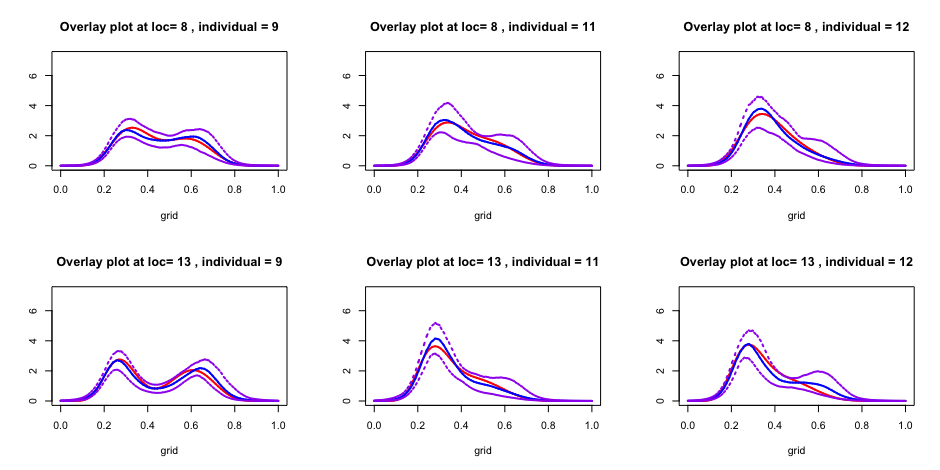
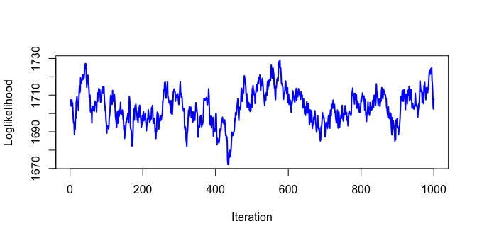
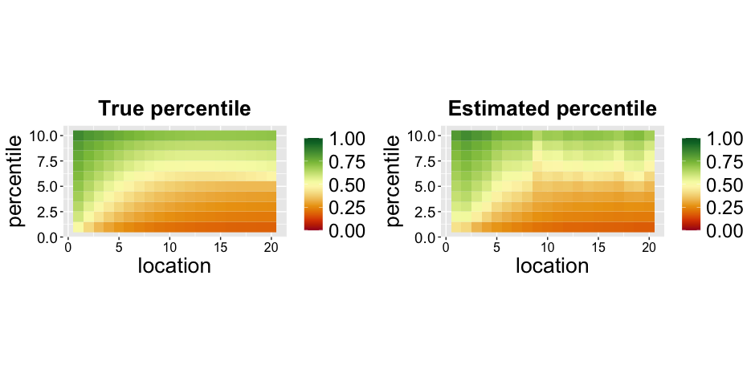
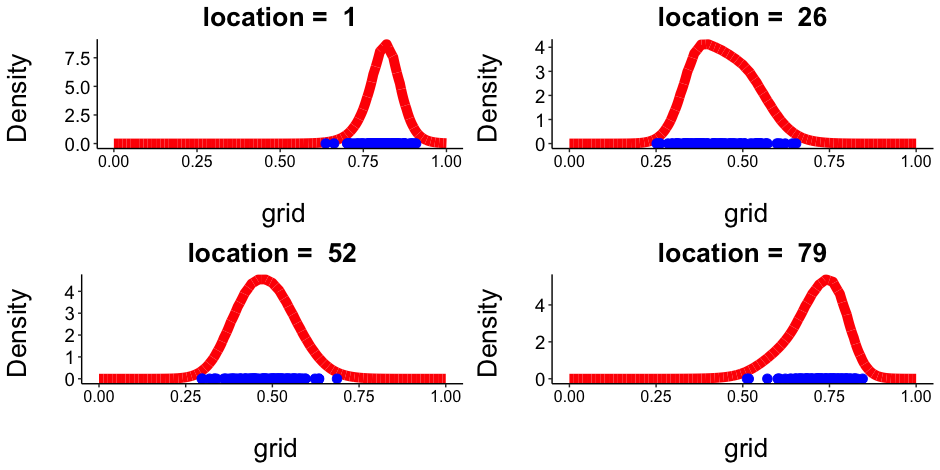
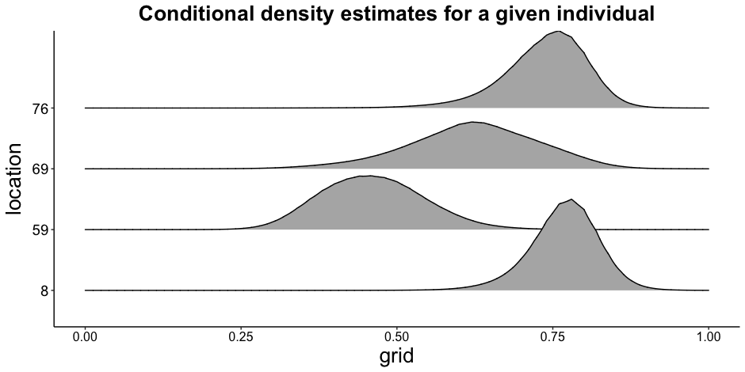
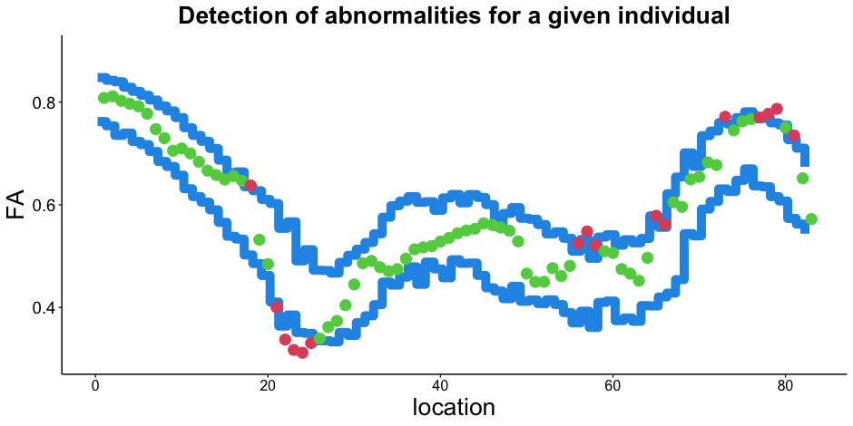

logisticGP package vignette
================

## Install R Package

``` r
#devtools::install_github("Zmup2eSNntdt/logisticGP")
```

## Load Library

``` r
library(ddalpha)
```

    ## Loading required package: MASS

    ## Loading required package: class

    ## Loading required package: robustbase

    ## Warning: package 'robustbase' was built under R version 4.3.1

    ## Loading required package: sfsmisc

    ## Loading required package: geometry

``` r
library(xgboost)
```

    ## Warning: package 'xgboost' was built under R version 4.3.1

``` r
library(logisticGP)
library(ggpubr)
```

    ## Loading required package: ggplot2

    ## Warning: package 'ggplot2' was built under R version 4.3.1

``` r
library(latex2exp)
library(gridExtra)
library(reshape2)
```

## Vignette

The associated vignette can be found [here](./vignette.pdf)

## Example

### Data Generation and Initialization

``` r
n1 <- 200 ## number of individual
p1 <- 5 ## number of co-variates
K1 <- 20 ## number of locations

n2 <- 0.2 * n1 ## test set
RNGkind(sample.kind = "Rejection")
set.seed(403) ## setting seed
index.sample <- sample(1:n1,size=n2,replace = F) ## random indices for test set 
## define beta0(s)
beta0_func <- function(j,x) {
  if(j==1)
    return(x^2+1) ## beta0_1(x)
  if(j==2)
    return((1-x)^2) ## beta0_2(x)
  if(j==3)
    return(4*x*(1-x)) ## beta0_3(x)
  if(j==4)
    return(-1 + 2*(x-0.75)^2) ## beta0_4(x)
  if(j==5)
    return(1.5 + 4*sin(x-0.5)) ## beta0_5(x)
  if(j==6)
    return(cos(x+2) + 0.25 * (x-0.5)^4 ) ## beta0_6(x)
  if(j==7)
    return(log(x+1)- 4*x^2) ## beta0_7(x)
  else
    return("wrong input")
}

beta0.true <- matrix(0,nr=p1,nc=K1) ## generate beta_0.true
for(j in 1:p1){
  beta0.true[j,] <- (matrix(beta0_func(j, seq(0,1,length.out = K1)),nr=1))
}

X1 <- matrix(runif(n1*p1,-5,5),nc=p1) ## generate covariates

## generate and normalize covariates
X1 <- apply(X1,MARGIN = 2,FUN = function(x)(x-mean(x))) 
max_norm<- max(sqrt(rowSums(X1*X1)))
X2 <- X1/max_norm

## normalize beta_0.true
beta <- beta0.true
beta0.true <- t(t(beta)/sqrt(colSums(beta * beta)))

## generate y
W_0 <- (kronecker(diag(ncol(beta)),X2) %*% matrix(as.vector(beta0.true),nc=1) + 1)/2
W_1 <- 2*(W_0-0.5) #Centralize the probability
y_vec <- numeric(nrow(X2) * ncol(beta0.true))
y1 <- matrix(0,nr=n1,nc=K1)
for (j in 1:K1) {
  for(i in 1:n1){
    y_vec[(j-1)*nrow(X2) + i] <- ifelse(runif(1)<=1/(1+exp(W_1[(j-1)*nrow(X2) + i])),
                                      rbeta(1,10*exp((j/ncol(beta0.true)-0.5)/2),4*j^{3/4}),
                                      rbeta(1,32*sin(W_0[(j-1)*nrow(X2) + i]),
                                            8*(j/ncol(beta0.true) +1)^{1/2}))
  }
}
y1 <- matrix(y_vec,ncol = ncol(beta0.true)) 

## define test & train set
test_knots <- seq(0,1, length.out = 51) ## location of knots
Nplus <- length(test_knots) ## number of knots

# index.sample = n1 + 50 ## if want to train on the whole data

X = X_train <- X2[-index.sample,]
X_test <- X2[index.sample,]
y = y_train <- y1[-index.sample,]
y_test <- y1[index.sample,]
```

### Initiate parameters

``` r
beta_Sigma <- 1*Sigma_kron(tau=0.10,rho=0.10, K=ncol(y), p=ncol(X)) ## Variance-Covariace matrix of pi(beta)
Gamma1 <- Matern_cov(test_knots, nu= 2.5, sigma = 1,theta = 0.292) ## Var-Cov matrix on \xi and \tau
CHOL1 <- t(chol(Gamma1))

xi <- matrix(CHOL1%*%rnorm(Nplus^2),nc=Nplus,byrow = T)
beta <- matrix(as.vector(mvtnorm::rmvnorm(1,mean = rep(0, ncol(X)*ncol(y)))),nc=ncol(y))
beta <- t(t(beta)/sqrt(colSums(beta * beta))) #normalize \beta
tau <- matrix(CHOL1%*%rnorm(Nplus^2),nc=Nplus,byrow = T)
h_loc <- hBasis(seq(0,(K1-1),by=1)/(K1-1),test_knots) # calculate the basis function
```

### Get updates using MCMC sampler

``` r
nmcmc <- 10000 ## number of MCMC sample
burnin <- 10000## number of burnin sample
thining <- 10
run1<- get_updates(xi=xi,
                   beta = beta, 
                   tau=tau,
                   CHOL1 = CHOL1,
                   h_loc = h_loc, 
                   X = X,
                   y = y,
                   test_knots = test_knots,
                   verbose = F, 
                   burnin = burnin,
                   nmcmc = nmcmc,
                   thining = thining)
## obtain the posterior samples
XI_mat <- run1$XI_mat.out
TAU_mat <- run1$TAU_mat.out
BETA_mat <- run1$BETA_mat.out
```

### Plotting CDE

``` r
n <- nrow(X) #no. of individuals
K <- ncol(y) #no. of Location
p <- ncol(X) #no. of covariates

grid <- seq(0,1,length.out = 10001) ## setting up density domain
par(mfrow=c(2,3))
location.1 <- sort(sample(1:K,2,replace = F)) ## spatial-locations where density required
density_mat <- matrix(0,nr=length(grid),nc=length(location.1)) ## initiate matrix to store density
density_mat.true <- density_mat
ind.index <- c(9,11,12) ## Random individuals for plots
X_new <- matrix(X_test[ind.index,],nc=p) ## covariates of selected individuals
for(i in 1:length(location.1))
{
  beta0.true.1 <- beta0.true[,location.1[i]]
  a.vec <- as.numeric((X_new%*%beta0.true.1+1)/2)
  a1.vec <- (a.vec-0.5)*2
  density.array <- PostFun_loc(XI_mat, grid, X_new, BETA_mat, TAU_mat, ## call Posterior density estimate
                              location = location.1[i],
                              test_knots = test_knots)
  for(j in 1:nrow(X_new)){
    a <- a.vec[j]
    a1 <- a1.vec[j]
    density.true <- dbeta(grid,10*exp((location.1[i]/ncol(beta0.true) - 0.5)/2),4*location.1[i]^{3/4})*1/(1+exp(a1)) +
      dbeta(grid,32*sin(a),8*(location.1[i]/ncol(beta0.true)+1)^{1/2})*1/(1+exp(-a1))
    
    density <- density.array[,,j]
    density_q2 <- apply(density,1,function(x) {quantile(x,0.50)}) ## estimated density
    density_q2 <- density_q2/sum(density_q2*(grid[2]-grid[1])) ## normalize density
    ## calculate quantiles at each grid position for density 
    density_q1 <- apply(density,1,function(x) {quantile(x,0.025)}) 
    density_q3 <- apply(density,1,function(x) {quantile(x,0.975)})
    max_lim <- min(max(density.true,density_q2),10^3)
    min_lim <- min(density.true,density_q2)
    plot(grid, density.true,ylab = "",ylim= c(0, 7.3), type = "l",col="red",lwd=2,lty=1, ## plot true density
         main = paste("Overlay plot at loc=",location.1[i],", individual =",ind.index[j]))
    lines(grid, density_q2,type = "l",col="blue",lwd=2,lty=1) ## plot estimated density
    lines(grid, density_q1,type = "l",col="purple",lwd=2,lty=4) ## plot quantiles
    lines(grid, density_q3,type = "l",col="purple",lwd=2,lty=4)
  }
}
```



### Model Diagnostics

- Plot log-likelihood of the estimated density.

``` r
par(mfrow=c(1,1))
plot(run1$LOG_Like.out,type='l',col='blue',
     lwd=2,ylab='Loglikelihood',xlab='Iteration')
```



- Compare theoretical percentiles with estimated percentiles

``` r
X_pred <- X_test[c(1,2),] ## Calculate percentile for individual #1 & #2  
n <- nrow(X_pred)
Niter <- nmcmc/thining
Median_mat <- array(0,dim = c(n,K,Niter))
u <- seq(0.05,0.95,by=0.10) ## percentile
b <- rep(0,length(u))
x.grid <- seq(0,1,length.out = 100001)
Median_mat.loc <- array(0,dim = c(n,K,length(u)))
Median_mat.loc.th <- array(0,dim = c(n,K,length(u)))

for(j in 1: length(u)){
  for(i in 1:Niter){
    xi <- XI_mat[,,i]
    tau <- (TAU_mat[,,i])
    beta <- as.matrix(BETA_mat[, , i])
    Median_mat[,,i] <- get_quantile(xi = xi,tau = tau,beta = beta, ## calculate percentile 
                                   test_knots = test_knots, #based on each posterior sample
                                   prob = u[j],X_pred = X_pred)
    #if(i%%100==0) print(c(i,j))
  }
  Median_mat.loc[,,j] <- apply(Median_mat,MARGIN = c(1,2), mean) ## find median (estimate) of percentile
}

##Calculate true percentiles

for (k in 1:n) {
  for(i in 1:K){
    beta0.true.1 <- beta0.true[,i]
    a <- as.numeric((X_pred[k,]%*%beta0.true.1 + 1)/2)
    a1 <- (a-0.5)*2
    A <- pbeta(x.grid,10*exp((i/K - 0.5)/2),4*i^{3/4})*1/(1+exp(a1)) +
      pbeta(x.grid,32*sin(a),8*(i/K+1)^{1/2})*1/(1+exp(-a1))
    
    for(j in 1:length(u)){b[j] <- (x.grid[min(which(A>u[j]))])}
    Median_mat.loc.th[k,i,] <- b
  }
  #print(k)
}

A <- melt(Median_mat.loc[1,,])
names(A) <- c('location','percentile','value')
B <- melt(Median_mat.loc.th[1,,])
names(B) <- c('location','percentile','value')
#A$percentile = B$percentile = u

My_Theme2 <-  theme(axis.text.x=element_text(size = 12,colour = "black"),
  axis.text.y = element_text(size = 14,colour = "black"),
  axis.title.y = element_text(size = 20), 
  axis.title.x = element_text(size = 20),
  plot.title = element_text(size=20,hjust = 0.5, face="bold"),
  legend.title = element_blank(), legend.text = element_text(size = 18))

p11 <- ggplot(A, aes(x = location, y = percentile, fill = value)) +
  geom_tile() + scale_fill_gradientn(colors = hcl.colors(20, "RdYlGn"), limits=c(0,1)) +
  coord_fixed() + labs(title = 'Estimated percentile') + My_Theme2 + theme(plot.title = element_text(hjust=0.5))

p22 <- ggplot(B, aes(x = location, y = percentile, fill = value)) +
  geom_tile() + scale_fill_gradientn(colors = hcl.colors(20, "RdYlGn"), limits=c(0,1)) +
  coord_fixed() + labs(title = 'True percentile') + My_Theme2 + theme(plot.title = element_text(hjust=0.5))

gridExtra::grid.arrange(p22,p11,ncol=2)
```



## Application to real Data

### fitting the model

``` r
set.seed(1616)
Covariates <- read.table("Covariates.txt")
Response <- read.table("Response.txt")
X <- lapply(Covariates[2:214,], function(x) as.numeric(as.character(x)))
X <- matrix(unlist(X),nr=213)
y <- matrix(unlist(Response),nr=213)

max_norm<- max(sqrt(rowSums(X*X)))
X2 <- X/max_norm
y1 <- y
n1 <- nrow(X)
n2 <- 0.2 * n1 ## test set
RNGkind(sample.kind = "Rejection")
set.seed(12)
index.sample <- sample(1:n1,size=n2,replace = F)
X = X_train <- X2[-index.sample,]
X_test <- X2[index.sample,]
y = y_train <- y1[-index.sample,]
y_test <- y1[index.sample,]

test_knots <- seq(0,1, length.out = 51)
Nplus <- length(test_knots)
K1 <- ncol(y)

beta_Sigma <- 1*Sigma_kron(tau=0.10,rho=0.10, K=ncol(y), p=ncol(X))

Gamma1 <- Matern_cov(test_knots, nu= 2.5, sigma = 1,theta = 0.292)
CHOL1 <- t(chol(Gamma1))

xi <- matrix(CHOL1%*%rnorm(Nplus^2),nc=Nplus,byrow = T)

beta <- matrix(as.vector(mvtnorm::rmvnorm(1,mean = rep(0, ncol(X)*ncol(y)))),nc=ncol(y))
beta <- t(t(beta)/sqrt(colSums(beta * beta)))
tau <- matrix(CHOL1%*%rnorm(Nplus^2),nc=Nplus,byrow = T)

h_loc <- hBasis(seq(0,(K1-1),by=1)/(K1-1),test_knots)
```

Define MCMC parameters and get updates

``` r
nmcmc <- 5000
burnin <- 5000
thining <- 5
run1 <- readRDS("./real_data_analysis.RDS")
XI_mat <- run1$XI_mat.out
TAU_mat <- run1$TAU_mat.out
BETA_mat <- run1$BETA_mat.out
```

``` r
nmcmc <- 5000
burnin <- 5000
thining <- 5
run1<- get_updates(xi=xi,
                   beta = beta, 
                   tau=tau,
                   CHOL1 = CHOL1,
                   h_loc=h_loc, 
                   X=X2,
                   y=y1,
                   test_knots = test_knots,
                   verbose = F, 
                   burnin = burnin,
                   nmcmc = nmcmc,
                   thining = thining)

XI_mat <- run1$XI_mat.out
TAU_mat <- run1$TAU_mat.out
BETA_mat <- run1$BETA_mat.out
```

### plotting real data

Fit the model.

``` r
XI_mat <- run1$XI_mat.out[,,501:1000]
TAU_mat <- run1$TAU_mat.out[,,501:1000]
BETA_mat <- run1$BETA_mat.out[,,501:1000]

n <- nrow(X) #no. of individuals
K <- ncol(y) #no. of Location
p <- ncol(X) #no. of covariates

set.seed(738)
grid <- seq(0,1,length.out = 10001)
location.1 <- c(1,26,52,79)
density_mat <- matrix(0,nr=length(grid),nc=length(location.1))
density_mat.true <- density_mat
density_mat.NNKCDE <- density_mat
ind.index <- sort(sample(1:nrow(X2),100,replace = F))
X_new <- matrix(X2[ind.index,],nc=p)
for(i in 1:length(location.1))
{
  density.array<- PostFun_loc(XI_mat, grid, X_new, BETA_mat, TAU_mat,
                              location = location.1[i],test_knots = test_knots)
  for(j in 1:nrow(X_new)){
    density <- density.array[,,j]
    density_q2 <- apply(density,1,function(x) {mean(x)})
    density_q2 <- density_q2/sum(density_q2*(grid[2]-grid[1]))
    density_mat[,i] <- density_mat[,i] + density_q2
    rm(density)
  }
  density_mat[,i] <- density_mat[,i]/nrow(X_new)
  rm(density.array)
} 
```

Plot CDE for an individual.

``` r
My_Theme2 <-  theme(axis.text.x=element_text(size = 12,colour = "black"),
  axis.text.y = element_text(size = 14,colour = "black"),
  axis.title.y = element_text(size = 20), 
  axis.title.x = element_text(size = 20),
  plot.title = element_text(size=20,hjust = 0.5, face="bold"),
  legend.title = element_blank(), legend.text = element_text(size = 18))

dat1 <- data.frame(grid,density_mat)
dat2 <- data.frame(y1[ind.index,location.1])
 

g1 <- ggplot(dat1,aes(x=grid,y=density_mat[,1])) + geom_line(lwd=3.5,col="red") + xlab("\n grid") + ylab("Density \n") + 
  ggtitle(paste("location = ",location.1[1])) +
    theme_classic() +  My_Theme2 + 
    geom_point(data = dat2, aes(x=y1[ind.index,location.1[1]],y=0),
               col="blue",size=3)

g2 <- ggplot(dat1,aes(x=grid,y=density_mat[,2])) + geom_line(lwd=3.5,col="red") + xlab("\n grid") + ylab("Density \n") + 
  ggtitle(paste("location = ",location.1[2])) +
    theme_classic() +  My_Theme2 + 
    geom_point(data = dat2, aes(x=y1[ind.index,location.1[2]],y=0),
               col="blue",size=3)

g3 <- ggplot(dat1,aes(x=grid,y=density_mat[,3])) + geom_line(lwd=3.5,col="red") + xlab("\n grid") + ylab("Density \n") + 
  ggtitle(paste("location = ",location.1[3])) +
    theme_classic() +  My_Theme2 + 
    geom_point(data = dat2, aes(x=y1[ind.index,location.1[3]],y=0),
               col="blue",size=3)

g4 <- ggplot(dat1,aes(x=grid,y=density_mat[,4])) + geom_line(lwd=3.5,col="red") + xlab("\n grid") + ylab("Density \n") + 
  ggtitle(paste("location = ",location.1[4])) +
    theme_classic() +  My_Theme2 + 
    geom_point(data = dat2, aes(x=y1[ind.index,location.1[4]],y=0),
               col="blue",size=3)

ggarrange(g1,g2,g3,g4, ncol=2, nrow = 2)
```



Ridge plot for an individual at some randomly selected location

``` r
source('density_ridge.R')

ggplot(data = density.df1, aes(x=grid, y=variable, height = value, group= variable)) +
  geom_density_ridges(stat = 'identity',scale=1.5) + theme_classic() + My_Theme2 + 
  labs(title = 'Conditional density estimates for a given individual',
       y = 'location')
```



We plot $20^{th}$ and $80^{th}$ percentile for an individual at
different locations and detect if there are observations outside the
normal range.

``` r
source('conf_ind.R')
My_Theme2 <- theme(axis.text.x=element_text(size = 12,colour = "black"),
  axis.text.y = element_text(size = 14,colour = "black"),
  axis.title.y = element_text(size = 20), 
  axis.title.x = element_text(size = 20),
  plot.title = element_text(size=20,hjust = 0.5, face="bold"),
  legend.title = element_blank(), legend.text = element_text(size = 18), legend.position = 'none')
ggplot(data.patient)+geom_step(aes(x=location-0.75,y=step1),size=3.5,col=4) +
  geom_step(aes(x=location-0.75,y=step2),size=3.5,col=4) + ylim(c(0.3,0.9)) +
  geom_point(aes(x=location,y=obs,col=col),size=4) + scale_color_manual(values = c(2,3)) +
  theme_classic() + My_Theme2 + labs(title = "Detection of abnormalities for a given individual",y=TeX('FA'),x='location')
```

    ## Warning: Using `size` aesthetic for lines was deprecated in ggplot2 3.4.0.
    ## ℹ Please use `linewidth` instead.
    ## This warning is displayed once every 8 hours.
    ## Call `lifecycle::last_lifecycle_warnings()` to see where this warning was
    ## generated.


